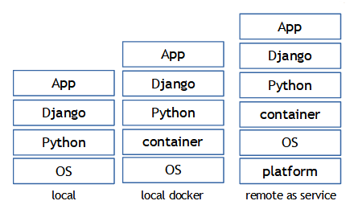
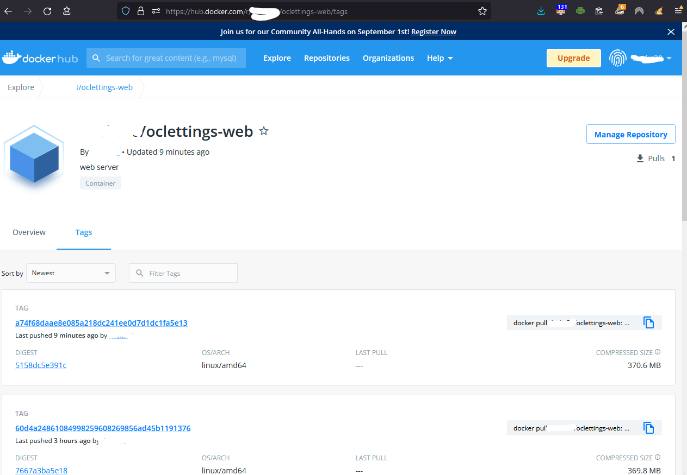
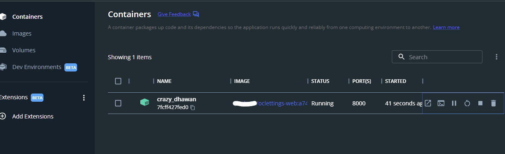
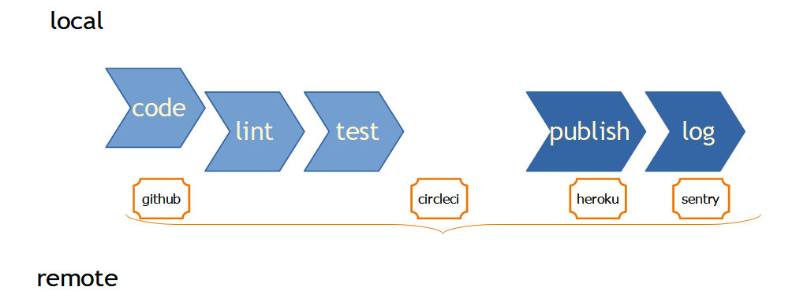
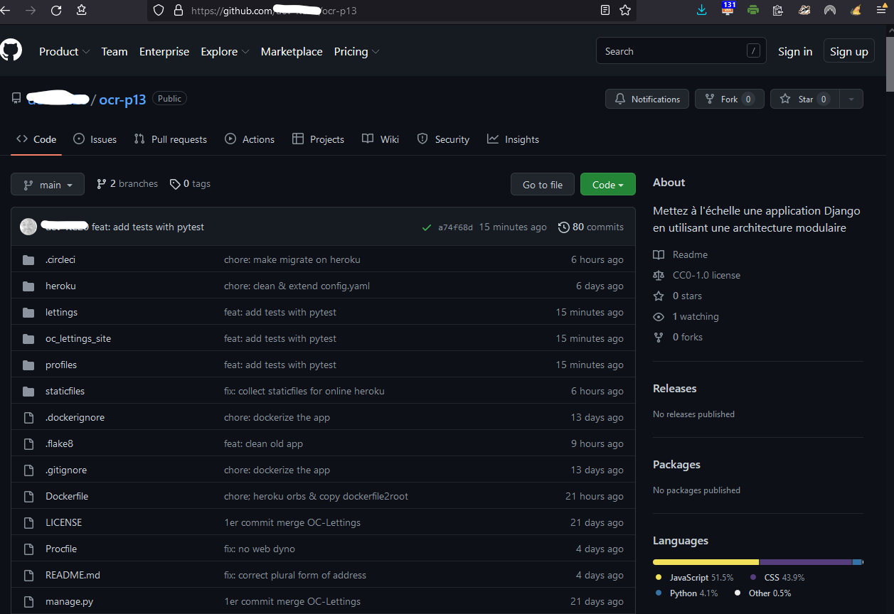
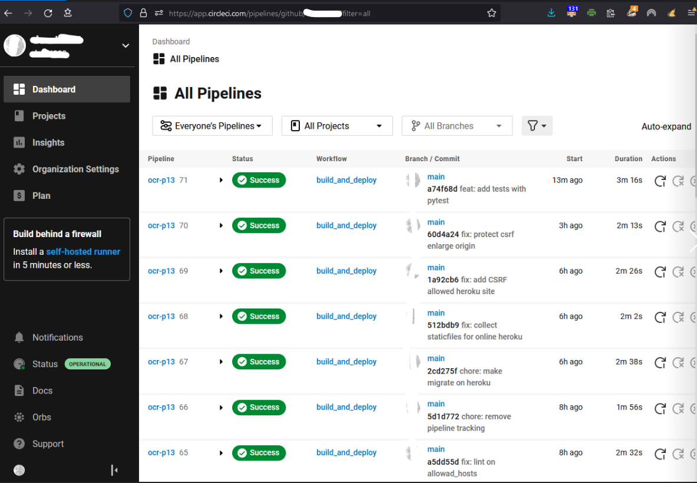
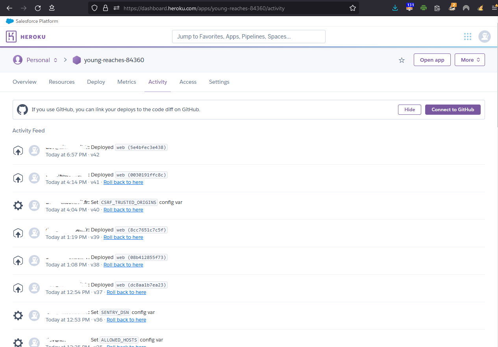
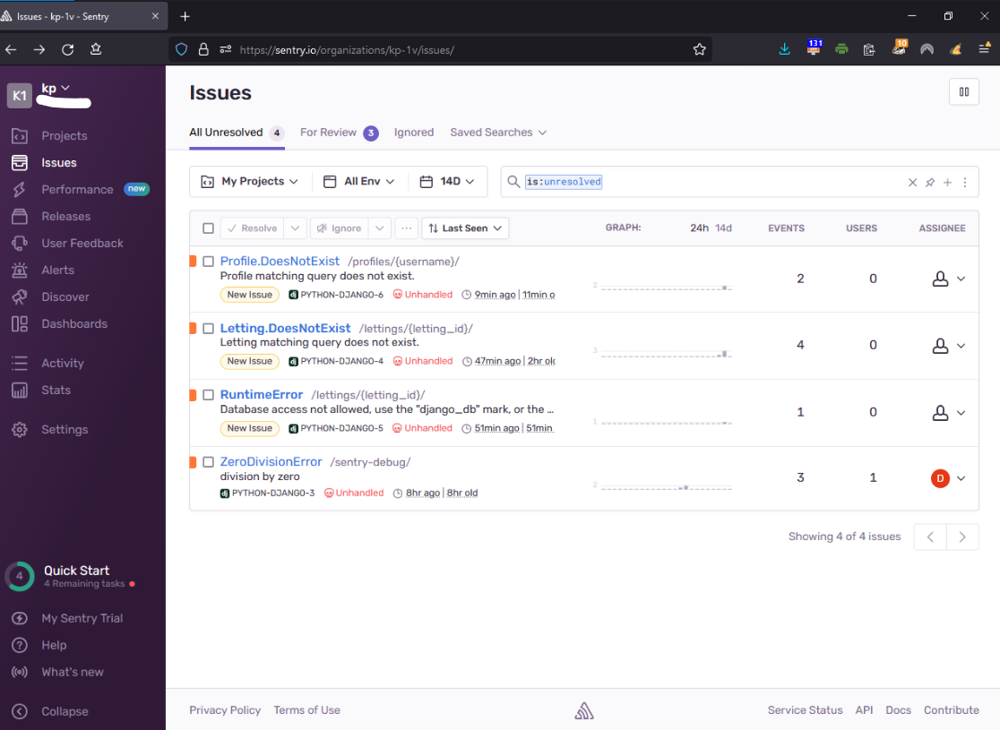
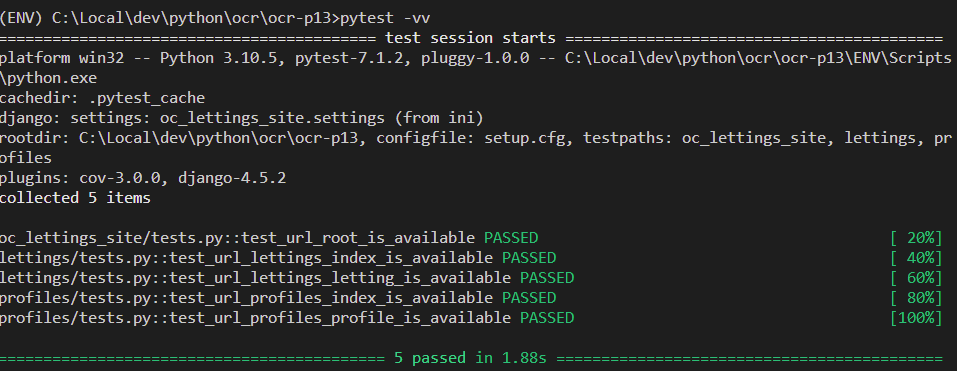

  
[](https://dl.circleci.com/status-badge/redirect/gh/dev-KC20/ocr-p13/tree/main)


# ocr-p13 Développez une architecture back-end sécurisée en utilisant Django ORM

  
  
- Table of Content
  - [Disclaimer](#disclaimer)
  - [Introduction](#introduction)
  - [Quick Start local](#1-local)
  - [Quick Start docker](#2-local-docker)
  - [Quick Start remote](#3-remote)
  - [Security and Privacy](#security-and-privacy)
  - [Refactoring ](#refactor)
  - [Tests passed](#tests-passed)
  - [Crédits and good reads](#credits-and-good-reads)
  - [PEP 8 check](#pep-8-check)


  
## Disclaimer

---

This code is the last part of the openclassrooms learning adventure split in 13 business alike projects. 

As a junior developper of the OC Lettings company, you've been asked to refactor the Lettings web site as well as to include the refreshed site into a continuous integration and a continuous delivery process **CI/CD**.
  
  
Some materials or links here may have rights to be granted to https://openclassrooms.com. 
The additionnal material follows "CC BY-SA ".
  
** Not to be used for production **  

---

## Introduction

...


Orange County Lettings decided to include its web site into a continuous improvement wheel.  
Three means to run the OC Lettings web site are available :  
  
  
  
**Have fun, Devs!**
  

## 1. local  

`instructions were tested on Windows10, VSCodium 1.70, Python 3.10, Django 4.0`

In order to install and use locally the O.C. Lettings site, assuming you have Python 3 installed on your computer, open a bash prompt and : 


1.  clone the ocr-p13 directory into your local copy.  
    `git clone https://github.com/dev-KC20/ocr-p13.git`   
  
2.  move to the working directory   
    `cd ocr-p13`   
  
3. create a python virtual environment named ENV  
    `python -m venv ENV`   
  
4.  do not forget to active the ENV virtual environment  
    `ENV\scripts\activate.bat`   

5.  install all the requirements,  
    `pip install -r requirements.txt`   

6.  create a .env file in order to keep all secrets local and safe (see hereunder for details),  
   
``` 
| where |(l)|(c)|(h)|   what key           |        content                  |  
|-------| --| --| --|----------------------|---------------------------------|  
|       | X | X | X | SECRET_KEY           | *yourverystrongandsecurekey*    |  
|       | O | O | O | ENVIRONMENT          | production development          |  
|       | O | O | O | ALLOWED_HOSTS        | localhost, 127.0.0.1,.heroku.com|  
|       | X | X | X | DISABLE_COLLECTSTATIC|         1                       |  
|       |   | X |   | HEROKU_API_KEY       | *yourherokuapikey*              |  
|       |   | X |   | HEROKU_APP_NAME      | the-app-name-from-heroku        |  
|       | X | X |   | DOCKER_USERNAME      | yourdockerhubaccount            |  
|       | X | X |   | DOCKER_PASSWORD      | *yourdockerhubpassword*         |  
|       | X | X | X | SENTRY_DSN           | sentry-url-to-sent-events-to    |  
|       | X |   |   | ADMIN_USERNAME       | the-app-superuser               |  
|       | X |   |   | ADMIN_PASSWORD       | the-app-superuser-password      |  
|       | X |   |   | ADMIN_EMAIL          | the-app-superuser-email         |  

(l): local  
(c): circleci  
(h): heroku   
 X: same value where crossed 
 O: value depends on context  
and used to store images on the dockerhub: IMAGE_REPO=oclettings-image-repo
and to create the initial superuser on heroku ADMIN_*
``` 

      
1. create and run Django models migration    
    `python manage.py makemigrations`     
    `python manage.py migrate`    
    
2. the Django superuser is:   
    `Username: admin`  
    `Password: Abcd1234!`  

3. Eventually run the server and follow instructions to open the site on your browser   
    `python manage.py runserver`     


## 2. local docker
  
We assume that you have a running docker daemon set on your computer.  

  

OC Lettings provides a proofchecked docker image that you collect by the following instructions:  

1. pull the lastest image available:  
    `docker pull $DOCKER_USERNAME/$IMAGE_REPO:$CIRCLE_SHA1`     

2. get and write down the docker image tag:  
    `docker images -q $DOCKER_USERNAME/$IMAGE_REPO`     

3. run the docker image tag:  
    `docker run --env-file .env -d -p 8000:8000 docker-image-tag`     

4. open your browser and navigate to:  
    `https://localhost:8000`      
    or  
    `https://localhost:8000/admin/`    

    remember credentials were provided on step 8. of the above '1. local' section. 

 
You could also do stepS 1,2 &3 in one with:   

`docker run --env-file .env -p 8000:8000 -i -t $DOCKER_USERNAME/$IMAGE_REPO:$CIRCLE_SHA1`     
  

  
  


## 3. remote  
  

OC Lettings had already a good practise to commit its source code changes to a github repo.   
We decided to add remote checks of the source base for linting issues as well as tests regression.  
If successfull, a docker image is built and stored on the company DockerHub repo.  
It is this very image that we recommend the developer use when they need to locally run the OC Lettings web site.  
  
The last part of our CI/CD pipeline is to push the image to our heroku app and run it from there.  
   
  
  
Also shown on the picture, the monitoring is done thru the sentry.io solution.  


### What do you need to run the CI/CD pipeline
  
- [GitHub account](https://github.com) in order to clone and host your own code  
    
  
   
- [Circleci](https://app.circleci.com/) free account in order to design and operate the CI/CD pipeline  
  
  
   
- [Dockerhub](https://hub.docker.com/) free account in order to push and pull the web app images from and to.  


- [Heroku](https://www.heroku.com/) free account in order to run the web app image.  
  
  
  
- [Sentry](https://sentry.io) free account in order to hook it to your app logs and set email alerts in case of issues during the operations.  
   
  
  
You will have to collect on circleci, dockerhub, heroku and sentry the token keys described in the above section 6 table and register them back the project environment variables as per the table.  
  

We also recommend that you install the **circleci CLI** and the **heroku CLI**. It will ease working with the pipeline and the app from your developper terminal.    

For instance before sending a new commit to the pipeline, the CLI is handy to check the syntax of your configuration file with :  

`circleci config validate .circleci/config.yml`  
  


### How it works  
  
From that step on, every time a commit is made in the github code repo, the circleci pipeline will run to check linting, test and if fine push the site image to the dockerhub.  

When the commit is made on the 'main' branch, it will in addition deploy a new release of the site on heroku.  
  
It is the config.yml file located under .circleci in the source code that buildq the circleci pipeline which will run once per commit.  
  
If you wich to rebuild the heroku hosted app, you can destroy it with the circleci CLI:  

 `heroku apps:destroy $HEROKU_APP_NAME`   

Before the next commit, you should update the config.yml file by commenting out the line:

 `heroku apps:create $HEROKU_APP_NAME --region eu `   

---

 
## Security and privacy  
    
Orange County Lettings and its co-workers do take your privacy and your data safety very seriously. 
Our IT team has set several security measures to ensure nothing bad may happen to your data.  

All technical operations are logged and help us to prevent and identify any mis-behavior or attacks

Finally the code itself is secured by reducing the exposure of secrets to public repositories,   


### Secret's management

Django uses "secret" to generate its certificates and advises to keep the secret key, secret.
OC Lettings uses the python-decouple module to replace the secret key's values of the settings.py file by their decouple link :
Storing actual secret in a .env file make its possible to keep them local provided one does exclude the .env file from the commits by regitering it in .gitignore.  

When being remote, it is important that one creates environment variables of the same key and values as the ones stored locally in the .env file. 
When remote, some key's value require a small change like the following one :  
                                                                                             `ALLOWED_HOSTS=.herokuapp.com`  
  
  


## Refactor  

Apart fixing issues and splitting apart the old project in two separate apps, the use of Django migrations in order to move the data was ...interesting. It code can be found at:  
- lettings\migrations\0002_auto_20220806_1439.py  
- profiles\migrations\0002_auto_20220807_1001.py


## Tests passed  

  
  
  

## Credits and good reads.
  
  
A special great "thank you" to Rami, my patient mentor who always knew how to bring me back to track! One day we will find the time needed to study one of your 'magical' algorithm ;-) 

To the Openclassrooms staff and even more the DA Python discord gals & guys!  
He doesn't know (yet) but Thierry Chappuis with his series of video webinaire saved me nights, thx!  
[Webinaires-pythonclassmates.org - YouTube](https://www.youtube.com/playlist?list=PLq7zFUM3vd6NNwb_5v0dj-Q2rt4-Ffr9F)

  
I would like also to credit the "Ile de France e-learning program" whose grant made it possible to attend this learning adventure.  
  
  
---    
  
Offical [Options Meta des modèles | Documentation de Django | Django](https://docs.djangoproject.com/fr/4.1/ref/models/options/)  
and mozilla [Django Tutorial Part 11: Deploying Django to production - Learn web development | MDN](https://developer.mozilla.org/en-US/docs/Learn/Server-side/Django/Deployment) documentations!  
  
The open source CLI project [How to use the CircleCI local CLI - CircleCI](https://circleci.com/docs/how-to-use-the-circleci-local-cli#validate-an-orb-in-your-configuration-file)   
  
  
I wasn't able to follow them all but Amal_Shaji has written a comprehensice post on docker best practises for Python devs.  
[Docker Best Practices for Python Developers | TestDriven.io](https://testdriven.io/blog/docker-best-practices/)  

  
Thx to Jermaine, Software Developer whose SO contribution made it to my tired brain on how I should trigger the heroku initial data migration and eventually get the Django admin site working!  
[python - Django: Create a superuser in a data migration - Stack Overflow](https://stackoverflow.com/questions/72131424/django-create-a-superuser-in-a-data-migration)   

  
to DavitTovmasyan for his documented post on moving a model from one app to the other.  
[How to safely move a model to another app in Django](https://davit.tech/django-move-model)  

  
  

## PEP 8 check
  
`flake8`   

not much to show : the console remains empty, so good!  
  
```bash  
(ENV) \dev\python\ocr\ocr-p13>flake8 
  
(ENV) \dev\python\ocr\ocr-p13>  
```  